# EducaRendez

## Application de gestion des rendez-vous scolaires

EducaRendez est une application multiplateforme développée avec **Flutter** dans le cadre d'un projet académique universitaire.

L'application permet aux **parents**, **enseignants** et **administrateurs** d'un établissement scolaire de gérer efficacement les rendez-vous grâce à une interface moderne, intuitive et sécurisée.

L'objectif principal est de faciliter la communication entre les différents acteurs de l'établissement tout en simplifiant l'organisation des rendez-vous.

---

# Aperçu du projet

- **Nom du projet :** EducaRendez
- **Type :** Application mobile académique
- **Framework :** Flutter
- **Langage :** Dart
- **Base de données :** SQLite
- **Plateformes :** Android • Windows
- **Architecture :** Flutter + SQLite

---

# Fonctionnalités principales

## Authentification

- Connexion sécurisée
- Création de compte
- Gestion des sessions
- Déconnexion

---

## Gestion des utilisateurs

L'application distingue trois catégories d'utilisateurs :

- Administrateur
- Enseignant
- Parent

Chaque profil dispose d'un espace personnel et de fonctionnalités adaptées à ses besoins.

---

## Tableau de bord Parent

Le parent peut :

- consulter les créneaux disponibles ;
- réserver un rendez-vous ;
- consulter l'historique de ses rendez-vous ;
- annuler un rendez-vous ;
- gérer son profil.

---

## Tableau de bord Enseignant

L'enseignant peut :

- consulter son planning ;
- gérer ses disponibilités ;
- consulter les demandes de rendez-vous ;
- suivre les rendez-vous programmés.

---

## Tableau de bord Administrateur

L'administrateur dispose d'un accès complet aux fonctionnalités de l'application :

- gestion des utilisateurs ;
- gestion des rendez-vous ;
- gestion des disponibilités ;
- statistiques ;
- rapports d'exploitation ;
- paramètres du système ;
- supervision générale.

---

## Gestion des rendez-vous

L'application permet :

- la création de rendez-vous ;
- la confirmation d'un rendez-vous ;
- l'annulation d'un rendez-vous ;
- le suivi de l'état des rendez-vous.

Les différents états sont :

- En attente
- Confirmé
- Annulé

---

## Gestion des disponibilités

Le système permet :

- d'ajouter des disponibilités ;
- de modifier les créneaux horaires ;
- de supprimer des disponibilités ;
- d'activer ou désactiver un planning.

---

## Statistiques et rapports

L'application fournit :

- des statistiques sur les rendez-vous ;
- des rapports d'exploitation ;
- des tableaux de bord permettant de suivre l'activité du système.

---

# Technologies utilisées

- Flutter
- Dart
- SQLite
- sqflite
- sqflite_common_ffi
- Material Design
- Poppins Font

---

# Structure du projet

```text
lib/
assets/
screenshots/
android/
ios/
linux/
macos/
web/
windows/
test/
pubspec.yaml
README.md
```

---

# Captures d'écran

## Accueil

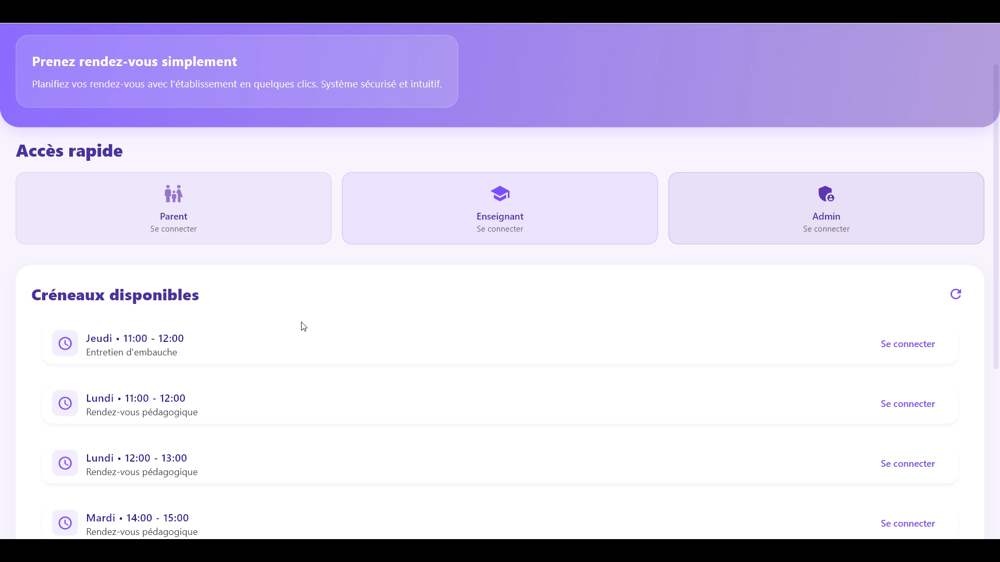

---

## Connexion

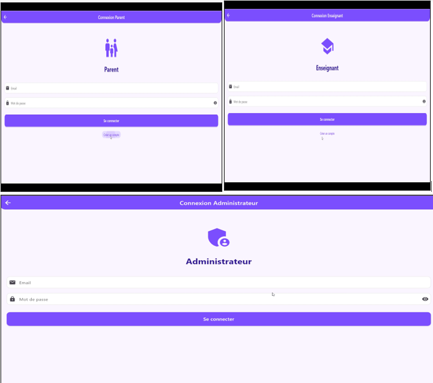

---

## Création d'un compte

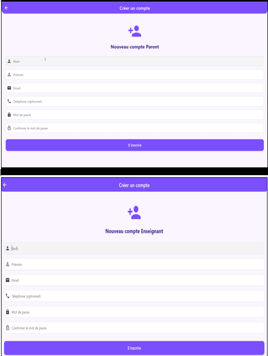

---

## Tableau de bord Administrateur


---

## Gestion des utilisateurs

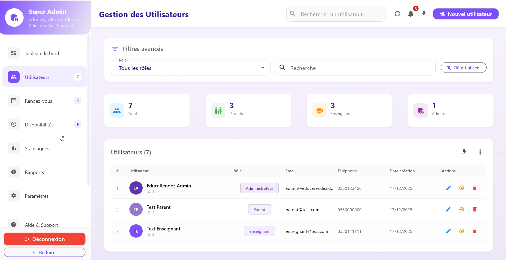

---

## Réservation d'un rendez-vous

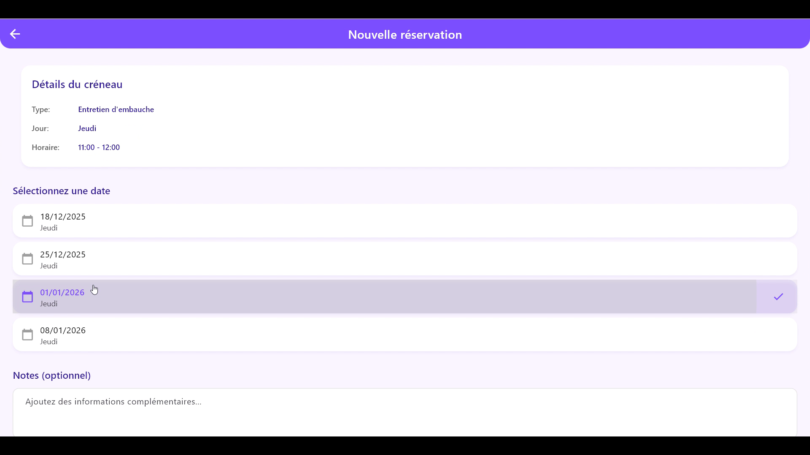

---

## Créneaux disponibles

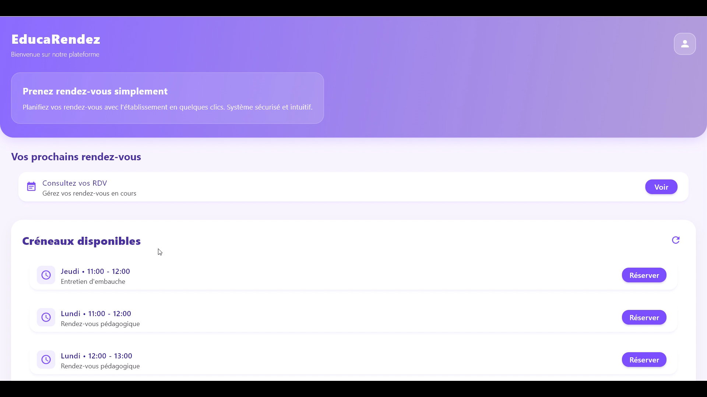

---

## Gestion des disponibilités

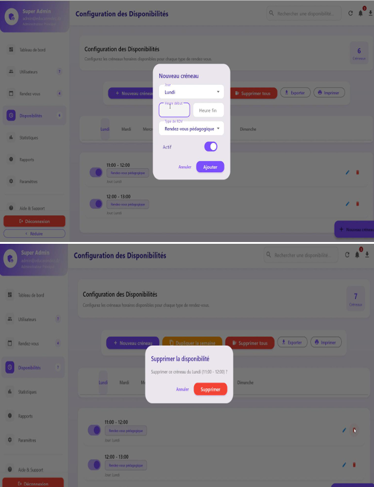

---

## Modification des disponibilités

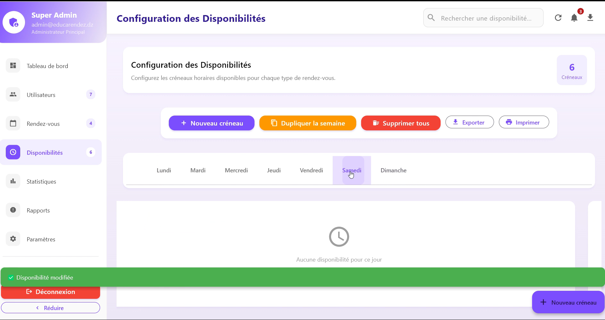

---

## Statistiques

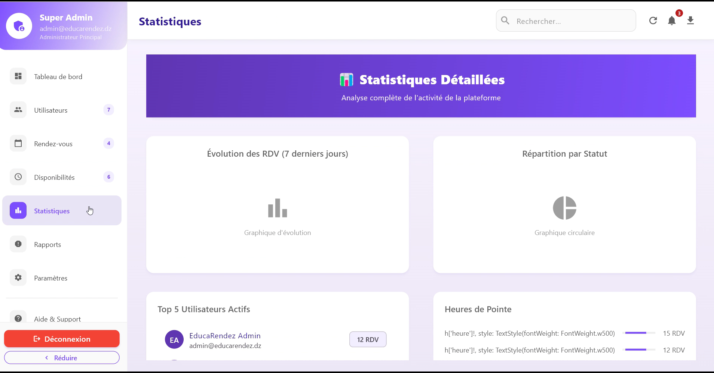

---

## Rapports d'exploitation

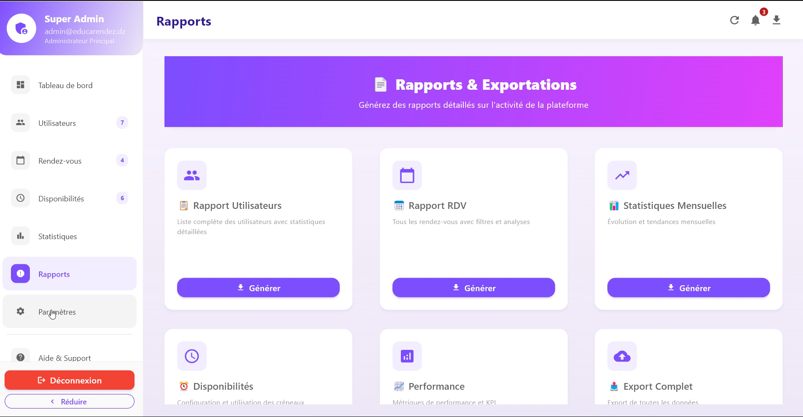

---

## Paramètres du système


---

## Mode sombre

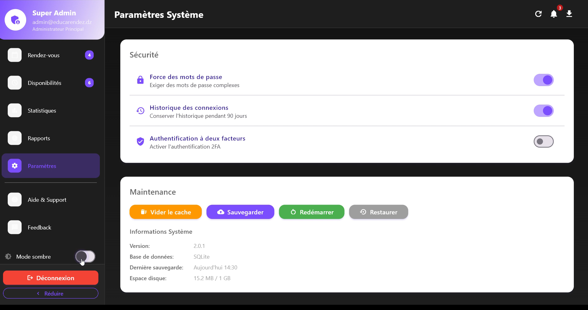

---

# Installation

### Cloner le dépôt

```bash
git clone https://github.com/kenzabelkacem-bit/creche-management-system.git
```

### Installer les dépendances

```bash
flutter pub get
```

### Exécuter l'application

```bash
flutter run
```

---

# Perspectives d'amélioration

Plusieurs évolutions peuvent être envisagées :

- intégration de Firebase ;
- notifications Push ;
- notifications par e-mail ;
- synchronisation Cloud ;
- authentification renforcée ;
- prise en charge des QR Codes ;
- internationalisation (multilingue) ;
- sauvegarde des données en ligne.

---

# À propos de la développeuse

**Kenza Belkacem**

Étudiante en **3ᵉ année du cycle Ingénieur d'État en Intelligence Artificielle**

Université Mouloud Mammeri de Tizi-Ouzou (UMMTO)

Algérie

Ce projet a été réalisé dans le cadre de ma formation universitaire afin de mettre en pratique les compétences acquises en développement mobile, conception logicielle, gestion de bases de données et interfaces utilisateurs.

---

# Licence

Ce projet est diffusé exclusivement à des fins académiques et pédagogiques.